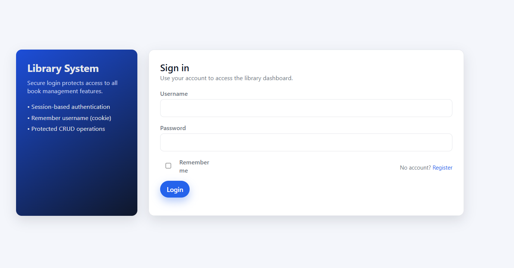
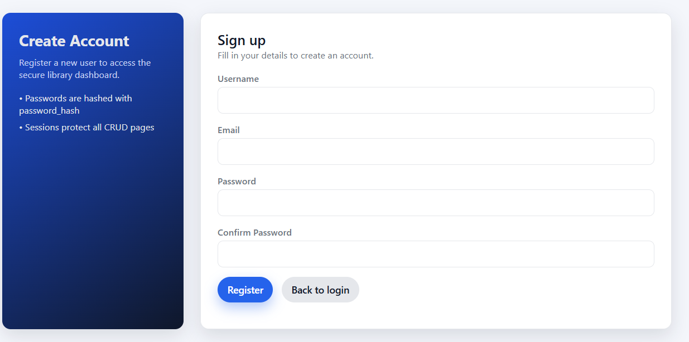
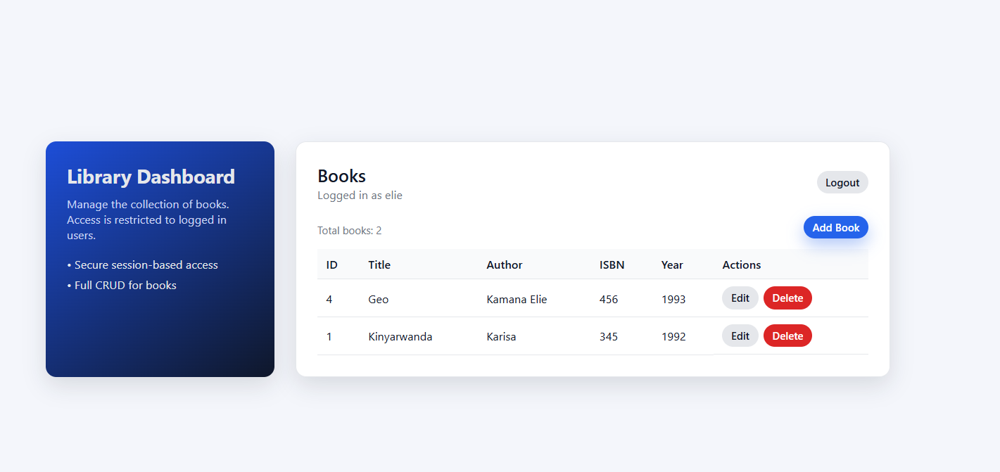
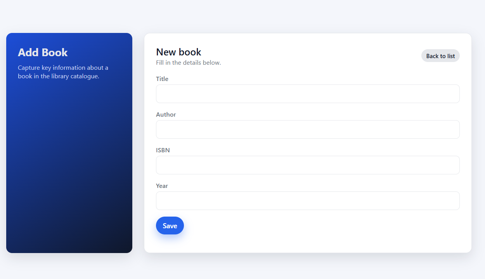
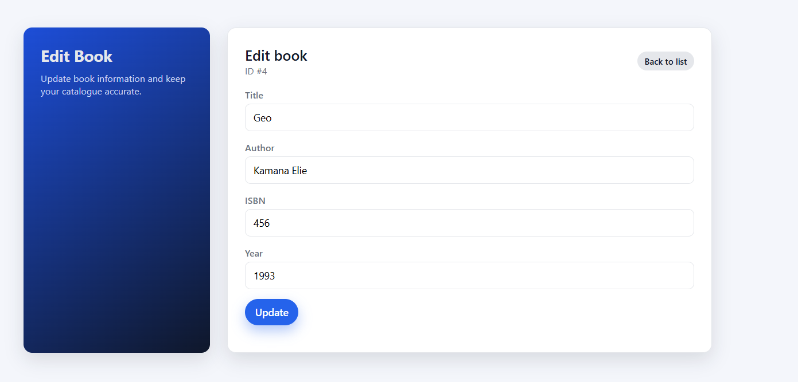

## How sessions were used

- `session_start()` is called on all scripts that need access to user state:
  - `login.php`, `register.php`, `auth.php`, and the CRUD pages via `auth.php`.
- After a successful login in `login.php`, the app calls `session_regenerate_id(true)` to prevent session fixation, and stores the user identity in the session:
  - `$_SESSION['user_id']`
  - `$_SESSION['username']`
- `auth.php` checks `$_SESSION['user_id']` on every protected page and redirects unauthenticated users to `login.php`. The authenticated user is exposed as `$currentUser` and displayed on the dashboard.

## How cookies were used

- The login page implements a simple "Remember Username" feature:
  - When the user ticks "Remember me", `login.php` sets a cookie `remember_username` with the username and a 30‑day expiry.
  - If the box is not ticked, the cookie is cleared.
- The login form reads this cookie and pre‑fills the username field, improving usability.
- Authentication itself is controlled by the PHP session, not by the cookie, which keeps the security model clear: cookies are used only for convenience, sessions for access control.

## How authentication is secured

- Passwords are hashed with `password_hash()` using PHP’s `PASSWORD_DEFAULT` algorithm and verified with `password_verify()` on login.
- All database access uses PDO prepared statements with bound parameters, which protects against SQL injection.
- On successful login, `session_regenerate_id(true)` is used to mitigate session fixation attacks.
- All CRUD pages (`books_list.php`, `books_create.php`, `books_edit.php`, `books_delete.php`) are protected behind `auth.php`.
  - If a user is not authenticated, they are redirected to `login.php`.
- User input is validated on the server side:
  - Registration checks required fields, email format, password confirmation, and uniqueness of username/email.
  - Books CRUD validates required fields (title, author).
- User‑supplied data is escaped using `htmlspecialchars()` before being rendered in HTML, which helps prevent cross‑site scripting (XSS).

## Screenshots

> Note: update the image paths (`screenshots/...`) to match the actual filenames in your project.

### Login page

The login screen shows the secure entry point to the system:

- Uses PHP sessions to authenticate users and call `session_regenerate_id(true)` on success.
- Demonstrates the **"Remember me"** checkbox which stores the username in a cookie (`remember_username`) so the field is pre‑filled on the next visit.
- Access to the protected CRUD dashboard is only possible after successful login.

### Register page

The registration screen demonstrates:

- Server‑side validation of username, email, password, and password confirmation.
- Email format validation and uniqueness checks for both username and email.
- Secure password storage using `password_hash()` before inserting into the `users` table.
- Automatic login after registration using PHP sessions.

### Library dashboard (Books list)

This page is the main protected CRUD dashboard:

- Displays the logged‑in user via `$currentUser['username']` at the top.
- Lists all books from the database and shows **Edit**/**Delete** actions.
- Is only accessible when a valid session exists (`auth.php` guard), proving that CRUD operations are not public.

### Add Book page

The add‑book form shows:

- A protected page that requires an authenticated session via `auth.php`.
- Server‑side validation for required fields (`title`, `author`).
- Insertion of new records using PDO prepared statements to prevent SQL injection.

### Edit Book page

The edit‑book form demonstrates:

- Fetching an existing book via prepared statements and populating the form.
- Updating the record securely with prepared statements.
- Continued protection by `auth.php`, ensuring that only logged‑in users can modify existing data.

# php_work
Php work
